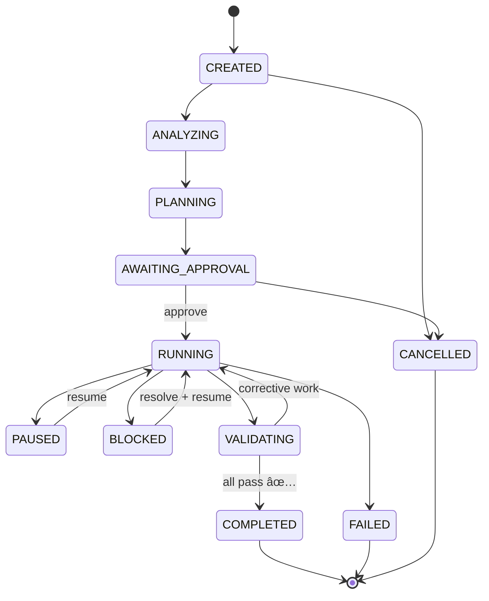

<div align="center">

<table align="center"><tr><td>

<pre>
 █████
░░███
 ░███████    ██████   █████████████    ███████  ██████   ██████   █████   ██████
 ░███░░███  ░░░░░███ ░░███░░███░░███  ███░░███ ███░░███ ███░░███ ███░░   ███░░███
 ░███ ░███   ███████  ░███ ░███ ░███ ░███ ░███░███ ░███░███ ░███░░█████ ░███████
 ░███ ░███  ███░░███  ░███ ░███ ░███ ░███ ░███░███ ░███░███ ░███ ░░░░███░███░░░
 ████ █████░░████████ █████░███ █████░░███████░░██████ ░░██████  ██████ ░░██████
░░░░ ░░░░░  ░░░░░░░░ ░░░░░ ░░░ ░░░░░  ░░░░░███ ░░░░░░   ░░░░░░  ░░░░░░   ░░░░░░
                                      ███ ░███
                                     ░░██████
                                      â–‘â–‘â–‘â–‘â–‘â–‘
</pre>

</td></tr></table>

**🦆 Factory-Droid-style Mission orchestration for [Goose](https://github.com/block/goose)**

[](https://pypi.org/project/hamgoose/)
[](https://img.shields.io/pypi/pyversions/hamgoose)
[](https://img.shields.io/pypi/dm/hamgoose)
[](https://www.npmjs.com/package/@cooked-ham/hamgoose)
[](LICENSE)
[](https://goose-docs.ai)
[](#why-its-different)

[](https://github.com/cooked-ham/hamgoose/stargazers)

**Type a goal → get a structured plan → approve → watch isolated workers build it, get validated, get corrected — until it's done and proven.**

</div>

```
USER GOAL → ANALYSIS → STRUCTURED PLAN → FEATURES + DEPS + MILESTONES → APPROVAL
  → DEPENDENCY-AWARE EXECUTION (isolated workers) → REAL CODE
  → SCRUTINY + USER-FACING VALIDATION → AUTOMATIC CORRECTION
  → FINAL VALIDATION → MISSION COMPLETED ✅
```

hamgoose is a genuine Goose **extension** — a standalone stdio MCP server on the
official `mcp`/`FastMCP` model, not a recipe, todo wrapper, or delegation
prompt. **Code enforces the orchestration mechanics; models do the semantic
reasoning.**

---

## 📖 Contents

- [✨ Features](#-features)
- [🚀 Quickstart](#-quickstart)
- [🎯 The walkthrough](#-the-walkthrough)
- [🏗️ How it works](#️-how-it-works)
- [📦 Install](#-install)
- [🛠️ The lifecycle (tools)](#️-the-lifecycle-tools)
- [🗄️ Where state lives](#️-where-state-lives)
- [🧪 Development](#-development)
- [📚 Docs](#-docs)
- [📜 License](#-license)

---

## ✨ Features

| | |
|---|---|
| 🚦 **Approval gate** | Nothing is implemented until *you* approve the plan |
| 🏝️ **Isolated leaf workers** | Each feature runs in its own `goose` subprocess inside a Git worktree — no nested delegation, crash containment, real diffs |
| 🕸️ **Dependency-aware scheduling** | A DAG of features with path-overlap conflict detection and a hard concurrency cap (your provider's limits, enforced in code) |
| 🔍 **Two validators** | *Scrutiny* distrusts the worker's claims and inspects diff + tests; *user-testing* exercises the app from the user's perspective |
| 🔁 **Automatic correction** | Failed validation becomes corrective features; the bounded loop repeats until the milestone passes |
| 🧯 **Crash recovery** | Atomic JSON state + append-only event log — kill Goose mid-mission, reopen, it reconciles and continues |
| 📡 **Live progress** | Long calls stream MCP progress notifications, and the guided flow runs in short visible bursts — you always see movement, never a silent wait |
| 🧭 **Steering & replanning** | Change course mid-mission without losing completed work |
| 🔐 **Secrets redacted** | Every persisted artifact scrubbed of keys, tokens, credentials |
| 🪶 **Per-repo state** | Lives in `<repo>/.goose/hamgoose/` — nothing global, trivially git-ignored |

## 🚀 Quickstart

**Node** — via npm:

```bash
npm i -g @cooked-ham/hamgoose
hamgoose register
```

**Python** — via pip:

```bash
pip install git+https://github.com/cooked-ham/hamgoose.git   # Python 3.11+
hamgoose register
```

**Either world, one shot (no install):** `npx @cooked-ham/hamgoose register`

> [!TIP]
> That's the whole install — two commands, no repo wiring, no config surgery.
> Pick **one** channel (npm *or* pip); both provide the same `hamgoose` command.
> Uninstall: `hamgoose unregister` + `npm uninstall -g @cooked-ham/hamgoose`
> (or `pip uninstall -y hamgoose`).

## 🎯 The walkthrough

Then, in **any** repository you're working in:

```text
$ goose
You:   /prompt start_mission
goose: What's the goal?
You:   Migrate the auth module from session cookies to JWT.
goose: Any rules or constraints? (concurrency, provider/model, git, validation)
You:   My provider only allows 3 concurrent agents at a time.
goose: Plan: 2 milestones, 6 features, workers capped at 3 concurrent. Approve?
You:   Approve.
goose: MS01 1/3 … passed scrutiny … MS02 2/3 …
       ✅ Mission COMPLETED — changes on branch mission/base with per-feature commits.
```

Rules are recorded **verbatim** on the mission (visible in every status and
plan view), translated into execution config ("max 3 concurrent" →
`max_concurrent_workers: 3`), and handed to **every worker** as context.
Mid-mission you can just say *"pause"*, *"don't touch config files"*, or
*"replan around X"* — steering and replanning never lose completed work.

> [!NOTE]
> No slash command? Just say **"start a hamgoose mission"** in plain English.
> `/prompt start_mission` runs the guided setup; plain English does the same thing.

## 🏗️ How it works

```mermaid
flowchart LR
    U["👤 You<br/>goal + rules"] --> G["Goose session"]
    G <-->|MCP stdio| H["🦆 hamgoose<br/>orchestrator<br/>(deterministic code)"]
    H -->|isolated goose run| W1["Worker F001<br/>🌳 worktree"]
    H -->|isolated goose run| W2["Worker F002<br/>🌳 worktree"]
    H --> V["🔍 Validators<br/>scrutiny + user-test"]
    W1 -->|merge + commit| R[("repo<br/>mission/base")]
    W2 -->|merge + commit| R
```





**Why it's different from "just let the agent do it":** the orchestrator is
*deterministic code* — state machines, DAG scheduling, retries, Git
bookkeeping, persistence are enforced, not hoped for. The LLM only does what
LLMs are good at: understanding intent and writing code. A confused model
can't corrupt the mission state, skip the approval gate, or double-dispatch
a feature. See [ARCHITECTURE_REPORT.md](ARCHITECTURE_REPORT.md) for the full
design analysis.

## 📦 Install

Requires `goose` (≥ 1.40) on your PATH and `git` (for Git missions).

| Option | For | Command |
|---|---|---|
| **1. From GitHub** ⭐ | Everyone | `pip install git+https://github.com/cooked-ham/hamgoose.git` then `hamgoose register` |
| **2. Goose's own menu** | No extra commands | `goose configure` → **Extensions → Add Extension** → STDIO / `hamgoose` / `hamgoose` |
| **3. From a clone** | Contributors | `git clone … && cd hamgoose && uv venv .venv && uv pip install -p .venv -e .` then `hamgoose register` |
| **4. Per-run** | One-off experiments | `goose run -t "..." --with-extension "hamgoose:python -m hamgoose"` |
| **5. npm (Node world)** | Node-first machines | `npm i -g @cooked-ham/hamgoose` then `hamgoose register` — or one-shot: `npx @cooked-ham/hamgoose register` |

> [!IMPORTANT]
> Pin a release once tags exist:
> `pip install "git+https://github.com/cooked-ham/hamgoose.git@v0.1.2"`.

<details>
<summary>🔧 What registration writes (manual option)</summary>

```yaml
# config.yaml — path printed by `goose info`
extensions:
  hamgoose:
    enabled: true
    type: stdio
    name: hamgoose
    description: Mission orchestration for Goose
    cmd: hamgoose
    args: []
```

</details>

## 🛠️ The lifecycle (tools)

| Operation | Tool |
|---|---|
| Create + analyze repo (guided setup) | `mission_create(goal, rules?, config?)` |
| Generate the plan (approval gate) | `mission_plan(mission_id)` |
| Approve & start | `mission_approve(mission_id)` |
| Execute the control loop (resumable) | `mission_run(mission_id, max_steps?)` |
| Pause / resume | `mission_pause` / `mission_resume` |
| Steer (priority / guidance) | `mission_steer(instruction, feature_id?, priority?)` |
| Replan (new constraint) | `mission_replan(instruction)` |
| Retry a feature / validate now | `mission_retry_feature` / `mission_validate(kind)` |
| Cancel | `mission_cancel` |
| Read status / plan / events / list | `mission_status` / `mission_plan_view` / `mission_events` / `mission_list` |

**Resources** (read): `mission://{id}/status|plan|events|features|milestones|validation`
**Prompts** (list with `/prompts`, run with `/prompt <name>`): `start_mission` (guided setup) · `plan_mission` · `resume_mission` · `validate_milestone`

## 🗄️ Where state lives

```
<repo>/.goose/hamgoose/<mission-id>/
├── mission.json     # canonical atomic state
├── mission.yaml     # human-readable mirror
├── plan.md          # plan mirror
├── events.jsonl     # append-only event log
├── workers/         # redacted worker transcripts
├── validation/      # validation reports
├── worktrees_base/  # mission/base worktree (merged result)
└── worktrees/<F>    # per-feature worktrees
```

Your current branch is **never modified** — `mission/base` accumulates the
merged, validated result for you to merge. Add `/.goose/hamgoose/` to your
repo's `.gitignore`.

## 🧪 Development

```bash
git clone https://github.com/cooked-ham/hamgoose.git && cd hamgoose
uv venv .venv
uv pip install -p .venv -e ".[dev]"
.venv/bin/python -m pytest -m "not realgoose"   # fast, deterministic (no LLM)
.venv/bin/python -m pytest -m "realgoose"       # real Goose + LLM (slower)
```

## 📚 Docs

- [ARCHITECTURE_REPORT.md](ARCHITECTURE_REPORT.md) — design decisions & compliance analysis
- [ARCHITECTURE.md](ARCHITECTURE.md) — component architecture
- [MISSION-LIFECYCLE.md](MISSION-LIFECYCLE.md) — state machines & control loop
- [CONFIGURATION.md](CONFIGURATION.md) — config reference, registration, known limitations
- [TESTING.md](TESTING.md) — test strategy
- [WINDOWS.md](WINDOWS.md) — Windows gotchas & hardening notes (cmd, cp1252, CRLF, tree kills, pipe hang, pytest temp)
- [FIX_PLAN.md](FIX_PLAN.md) — the v0.1.8 hardening fix plan & implementation record (HG-01…HG-17)
- [remainingwork_hamgoose.md](remainingwork_hamgoose.md) — the original failure evidence from 5 missions
- [PUBLISHING.md](PUBLISHING.md) — PyPI release runbook

## 📜 License

MIT — see [LICENSE](LICENSE).

---

<div align="center">

**Built on [Goose](https://github.com/block/goose) · [MCP](https://modelcontextprotocol.io) · 🦆**

</div>
